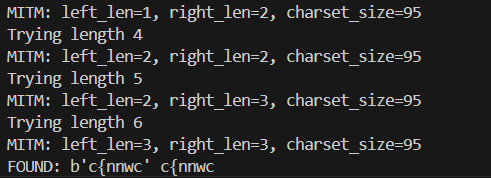
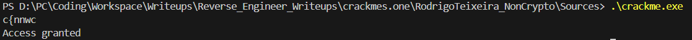

# General Information
- Solved date: 08/19/2025
- Name: RodrigoTeixeira's Non-cryptographically secure hash (my first crackme!)
- Difficulty: 2.0
- Quality: 4.0
- Language: C/C++
- Platform: Unix/Linux etc.
- Arch: x86-64
- Source: https://crackmes.one/crackme/68a2074a8fac2855fe6fb69c
# Solve
- Thankfully, the challenge generously provided us with the original C code, the assembly, and its executable, we will be looking at the C code

```cpp
#include <stdio.h>

#define PASSWORD 1113772777

int hash(char* str) {
	int ret = 0xA5A5A5A5;
	while (*str) {
		ret = (ret << 5) - ret + *(str++);
	}
	return ret;
}

int auth() {
	char pass[16];
	gets(pass);
	return hash(pass) == PASSWORD;
}

void grant_access() {
	printf("Access granted");
	return;
}

int main() {
	if (auth()) {
		grant_access();
	}
}
```

- What we really want to care about is the hash function, because this is where we will need to understand to reverse the password (this is possible because the hashing algorithm can be reversed). The formula of the password goes like this, given n is the length of the password:
```
0xA5A5A5A5 * 31 ** n + str[0] * 31 ** (n - 1) + str[1] * 31 ** (n - 2) + ... + str[n - 1] * 31 ** 0
```

- There are two methods, which I have included the corresponding scripts in the Sources folder (crackscript.py and crackscriptfaster.py). The first one simply reverse the formula, for i in range(n), find all possible printable ASCII characters until you get the correct password. However, this is painfully slow even at n = 4, so don't actually use crackscipt.py. So, I used the second method (Meet-in-the-middle), which I asked ChatGPT lol.

```py
# crackscriptfaster.py
from itertools import product
from collections import defaultdict

TARGET = 1113772777
SEED   = 0xA5A5A5A5
MASK   = 0xFFFFFFFF
CHARSET = [i for i in range(32,127)]   # printable
# CHARSET = list(range(48,58))  # digits-only (much smaller)

def forward_hash_from_seed(bytes_seq, start_seed=SEED):
    h = start_seed
    for b in bytes_seq:
        h = ((h * 31) + b) & MASK
    return h

def base31_from_zero(bytes_seq):
    h = 0
    for b in bytes_seq:
        h = ((h * 31) + b) & MASK
    return h

def mitm_for_length(n, charset=CHARSET):
    # split
    left_len = n // 2
    right_len = n - left_len
    pow31_right = pow(31, right_len, 1 << 32)

    print(f"MITM: left_len={left_len}, right_len={right_len}, charset_size={len(charset)}")

    # build map for right halves: value -> one example bytes
    right_map = dict()
    for tup in product(charset, repeat=right_len):
        rb = bytes(tup)
        rval = base31_from_zero(rb)
        # store one representative (or append to list if you want all)
        if rval not in right_map:
            right_map[rval] = rb

    # now enumerate left halves and look up matching right
    for tup in product(charset, repeat=left_len):
        lb = bytes(tup)
        left_hash = forward_hash_from_seed(lb)  # hash after left part
        need = (TARGET - (left_hash * pow31_right)) & MASK
        if need in right_map:
            candidate = lb + right_map[need]
            if forward_hash_from_seed(candidate) == (TARGET & MASK):
                return candidate
    return None

if __name__ == "__main__":
    # try different lengths
    for n in range(1, 7):   # adjust upper bound as you want
        print("Trying length", n)
        sol = mitm_for_length(n)
        if sol:
            print("FOUND:", sol, sol.decode(errors='replace'))
            break
    else:
        print("No solution found in range tried.")

```

<div style="margin: auto; display: flex; justify-content: center; align-items: center">
    
    </img>
</div>

- Confirm the password by running the provided executable

<div style="margin: auto; display: flex; justify-content: center; align-items: center">
    
    </img>
</div>

