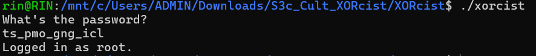

# General Information
- Solved date: 08/20/2025
- Name: S3c_Cult's XORcist
- Difficulty: 1.7
- Quality: 5.0
- Language: C/C++
- Platform: Unix/Linux etc.
- Arch: x86-64
- Source: https://crackmes.one/crackme/684f47bd2b84be7ea774390e
# Solve
- Thankfully, the challenge generously provided us with the original C code so we will be looking at the C code.

```cpp
int main() {
    if (isDebuggerPresent()) {
        printf("Nooooooo. La Policiaaa.\n");
        return 1;
    }

    Agent ag;
    ag.id = (rand() % 100) + 1; // Make sure it's never 0
    strcpy(ag.name, "root");
    ag.check_fn = &validate;

    char input[32];
    printf("What's the password?\n");
    fgets(input, sizeof(input), stdin);
    input[strcspn(input, "\n")] = 0;

    char c = (rand() % (126 - 32 + 1)) + 32;
    char c_str[2];
    c_str[0] = c;

    srand(time(NULL));
    int rand_val = rand() % 6969 + 1;
    int distract = useless_branch(rand_val);

    if (ag.check_fn(input) && ag.id != 0) {
        printf("Logged in as %s.\n", ag.name);
    } else {
        printf("Nuh Uh Nuh Uh.\n");
    }

    return 0;
}
```
- Looking at the main function, even though there are some distractions, what we really care about is the password input and the checker, which is the validate function, which is as followed:
```cpp
int validate(const char *input) {
    const char *enc = "\xdd\xda\xf6\xd9\xc4\xc6\xf6\xce\xc7\xce\xf6\xc0\xca\xc5";
    char temp[16];
    strcpy(temp, enc);
    decrypt(temp);
    return strcmp(input, temp) == 0;
}
```
- There seems to be a hardcoded encrypted password **enc**, and that **enc** will be decrypted when comparing it against our input. Let's check the decrypt function next.
```cpp
#define KEY 0xA9

void decrypt(char *str) {
    for (int i = 0; str[i]; i++) {
        str[i] ^= KEY;
    }
}
```
- It is just a very simple XOR operation on each character, with the hardcoded key **0xA9**! We can grab the password by XOR'ing the encrypted password again with the key with this script as followed:
```py
enc = b'\xdd\xda\xf6\xd9\xc4\xc6\xf6\xce\xc7\xce\xf6\xc0\xca\xc5'
s = []
for c in enc:
    c = chr(c ^ 0xA9)
    s.append(c)
print("".join(s))
```
- After running the script, we got the password **ts_pmo_gng_icl**! Confirm the password by running the provided executable, or the C code.

<div style="margin: auto; display: flex; justify-content: center; align-items: center">
    
    </img>
</div>

