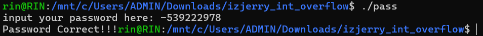

# General Information
- Name: izijerry's int overflow
- Difficulty: 1.6
- Quality: 4.1
- Language: C/C++
- Platform: Unix/Linux etc.
- Arch: x86-64
- Source: crackmes.one/crackme/6894d8e98fac2855fe6fb3ff
# Solve
- Opening the file using IDA Pro and checking the main function, we can immediately see that the program will take our input, interpret it to a number, and check if it matches the number -539222978, which is our answer.
```cpp
int __fastcall main(int argc, const char **argv, const char **envp)
{
  char *nptr; // [rsp+8h] [rbp-8h]

  nptr = (char *)GetPass(argc, argv, envp);
  if ( atoi(nptr) == -539222978 )
    printf("Password Correct!!!");
  else
    printf("Incorrect Password!!!");
  return 0;
}
```
- Run the executable to confirm (I run it in WSL)

<div style="margin: auto; display: flex; justify-content: center; align-items: center">
    
    </img>
</div>


