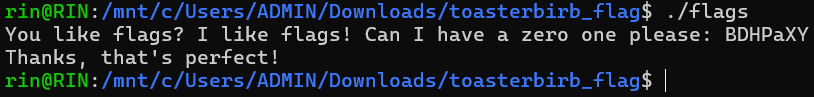

# General Information
- Solved date: 08/19/2025
- Name: toasterbirb's flags
- Difficulty: 1.5
- Quality: 4.0
- Language: C/C++
- Platform: Unix/Linux etc.
- Arch: x86-64
- Source: https://crackmes.one/crackme/686918c6aadb6eeafb398fbd
# Solve
- Opening the file using IDA Pro and checking the main function, the program will first print out a line, prompting us to input the 'flag', which is supposedly 8-byte long. Also, v3 is the value of the eflags register AND'd by 0xF0, so only bit 5-8 of the register is retained in v3, which includes the Zero Flag (ZF, the sixth bit), which is important to for this challenge. 
```cpp
__int64 start()
{
  size_t v0; // rax
  signed __int64 v1; // rax
  unsigned __int8 v2; // kr00_1
  unsigned __int64 v3; // r10
  char *v4; // rax
  __int64 v5; // rcx
  char v6; // zf
  size_t v7; // rsi
  signed __int64 v8; // rax
  size_t v9; // rsi
  signed __int64 v10; // rax

  v0 = sub_401140(aYouLikeFlagsIL);
  sub_4010F0(aYouLikeFlagsIL, v0);
  v1 = sys_read(0, buf, 8uLL);
  v2 = __readeflags();
  v3 = v2 & 0xF0;
  v4 = buf;
  v5 = 5LL;
  while ( v5 )
  {
    LOBYTE(v3) = (*v4++ << v5--) & v3;
    __writeeflags(v3);
    if ( !v6 )
      goto LABEL_6;
  }
  __writeeflags(v3);
  if ( v6 )
    goto LABEL_7;
LABEL_6:
  v7 = sub_401140(aIDonTThinkThat);
  sub_4010F0(aIDonTThinkThat, v7);
  v8 = sys_exit(0);
LABEL_7:
  v9 = sub_401140(aThanksThatSPer);
  sub_4010F0(aThanksThatSPer, v9);
  v10 = sys_exit(0);
  return sub_4010F0(0LL, v9);
}
```
- Interestingly, the program does not check all of the bytes, but just the first 5 bytes of our input, by:
    - Shift each character in our input by 5 - i times.
    - AND the result with v3.
    - Check if the ZF is 1. If not, it breaks and prints out the failure message.
- After knowing what the checker does, it is clear that our answer must have these attributes:
    - First character: first (from right to left) bit set to 1
    - Second character: second (from right to left) bit set to 1
    - Third character: third (from right to left) bit set to 1
    - Fourth character: fourth (from right to left) bit set to 1
    - Fifth character: fifth (from right to left) bit set to 1
    - The rest can be whatever because the loop only checks the first five characters.
- These attributes of our input are like these so that after shifting, the ZF (sixth bit of v3) is 1. In my case, I used this answer: **BDHPaXY\n**
- Run the executable to confirm (I run it in WSL)

<div style="margin: auto; display: flex; justify-content: center; align-items: center">
    
    </img>
</div>