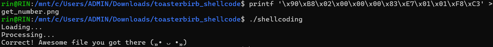

# General Information
- Solved date: 08/20/2025
- Name: toasterbirb's shellcoding
- Difficulty: 2.0
- Quality: 4.0
- Language: C/C++
- Platform: Unix/Linux etc.
- Arch: x86-64
- Source: https://crackmes.one/crackme/6869167eaadb6eeafb398fb4
# Solve
- Opening the file using IDA Pro and checking the main function, the program calls these two functions **sub_12F0** and **sub_1390**, so lets check what these two functions do first.
```cpp
_OWORD *sub_12F0()
{
  FILE *v0; // rax
  FILE *v1; // rbp
  _OWORD *v2; // rbx
  __m128i v3; // xmm0

  v0 = fopen("get_number.png", "r");
  if ( v0 )
  {
    v1 = v0;
    v2 = mmap(0LL, 0x10uLL, 7, 34, -1, 0LL);
    v3 = _mm_shuffle_epi32(_mm_cvtsi32_si128(0xB0F0B0Fu), 0);
    *v2 = v3;
    v2[1] = v3;
    if ( !fread(v2, 1uLL, 0x10uLL, v1) )
    {
      v2 = 0LL;
      puts("The file was empty :(");
    }
  }
  else
  {
    v2 = 0LL;
    puts("File could not be opened");
  }
  return v2;
}
```
- Alright, **sub_12F0** will read the first 16 bytes of a file called *get_number.png*. Let's continue checking **sub_1390**.
```cpp
__int64 __fastcall sub_1390(_BYTE *a1)
{
  if ( *a1 == 0x90 )
    return 1LL;
  puts("I'm not happy with the first byte");
  return 0LL;
}
``` 
- So **sub_1390** simply checks if the first byte is 0x90, which is the NOP operation in this architecture's assembly. After knowing what these two functions do, let's go back to the main function and see what it is trying to do.
```cpp
__int64 __fastcall main(int a1, char **a2, char **a3)
{
  __int64 v3; // rax
  __int64 (__fastcall *v4)(time_t); // rbp
  time_t v5; // rax
  int v6; // r12d
  time_t v7; // rbx

  puts("Loading...");
  v3 = sub_12F0("Loading...", a2);
  if ( !v3 || (v4 = (__int64 (__fastcall *)(time_t))v3, !(unsigned int)sub_1390(v3)) )
    exit(1);
  puts("Processing...");
  v5 = time(0LL);
  v6 = v4(v5) + ((v5 & 1) == 0);
  sleep(1u);
  v7 = time(0LL);
  if ( v6 + ((v7 & 1) == 0) + (unsigned int)v4(v7) == 6 )
    puts(aCorrectAwesome);
  else
    puts("That doesn't seem right... You need to work a bit more on that file");
  return 0LL;
}
```
- Basically, the main function will do these things:
    - Check if the *get_number.png* is present, and if the first byte of the file is 0x90. It exits if the conditions are not all satisfied.
    - v5 = current time and v7 = current time + 1, both v5 and v7 are checked if they are even in the checker expression (*v6 + ((v7 & 1) == 0) + (unsigned int)v4(v7) == 6*), and since v6 is *v4(v5) + ((v5 & 1) == 0)*,and v7 = v5 + 1, the checker can simplified to this, with f() is the function v4 gets assigned to in the function:
```
f(v5) + f(v5 + 1) + 1 == 6
```
- After knowing what the main function does, our next step is clear: write the instructions in that first 16-byte block of *get_number.png*, so that program will read it, pass it back to v4 as function so that the expression **f(v5) + f(v5 + 1) + 1 == 6** is satisfied.
- Based on what we need to do, I was thinking that I had to make f(v5) return 2 and f(v5 + 1) return 3, so the intended assembly will look something like this:
```cpp
nop                 ; 0x90 — required by the program
mov  eax, 2         ; 0xB8 02 00 00 00
and  edi, 1         ; 0x83 E7 01   -> edi = edi & 1
add  eax, edi       ; 0x01 F8      -> eax += edi (so return = 2 + (t & 1))
ret                 ; 0xC3
```
- The idea is that since eax returns the final result, we can simply assign it to 2, and since rdi, or edi register stores our argument, we can AND it with 2 again, so that eax can be guaranteed to be either 2 or 3. And as the comments suggest, the byte we should be injecting into the file will be:
```
90 B8 02 00 00 00 83 E7 01 01 F8 C3
```
- How can we inject those bytes into the file? We can use this:
```cpp
printf '\x90\xB8\x02\x00\x00\x00\x83\xE7\x01\x01\xF8\xC3' > get_number.png
```
- Run the executable to confirm (I run it in WSL)

<div style="margin: auto; display: flex; justify-content: center; align-items: center">
    
    </img>
</div>