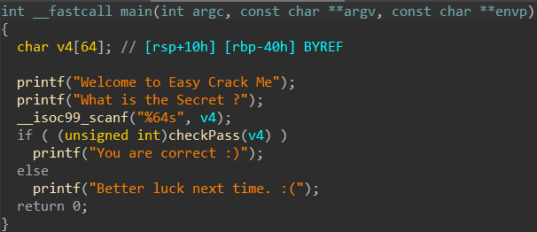
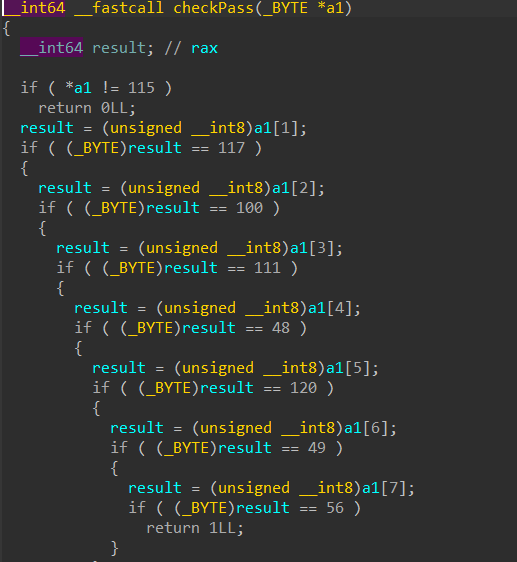
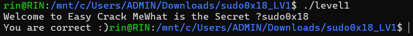

# General Information
- Name: sudo0x18's Level1
- Difficulty: 1.1
- Quality: 4.1
- Language: C/C++
- Platform: Unix/Linux etc.
- Arch: x86-64
- Source: https://crackmes.one/crackme/646627a933c5d439389131d9
# Solve
- Opening the file using IDA Pro and checking the main function, we see that the program asks for a password, which is then checked through the checkPass function.

    
    </img>

- Looking at the checkPass function, the function simply checks for each character of our input to see if it matches its hardcoded password.
- The next step is clear, we look up our ASCII table and find that the password is sudo0x18

    
    </img>

- Confirm the password by running the executable (in my case, I ran the file through WSL)

    
    </img>

